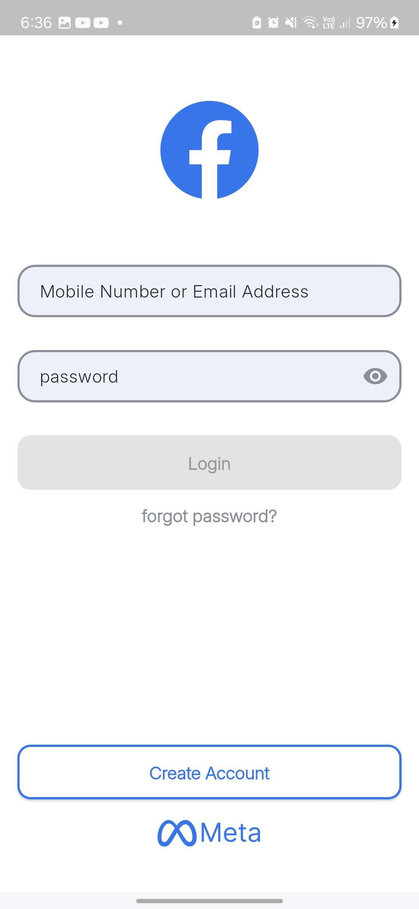
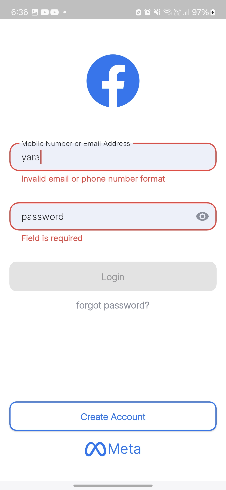
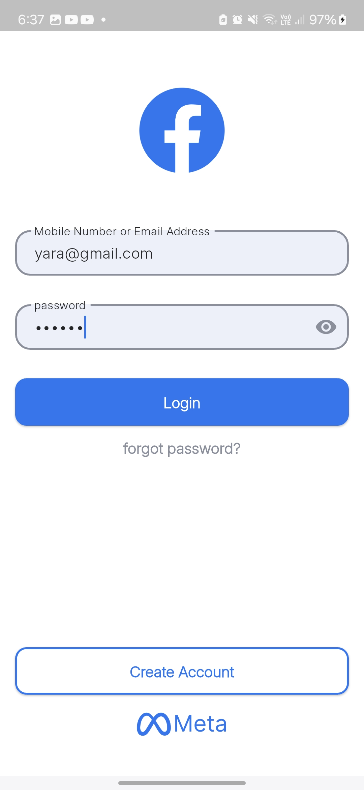
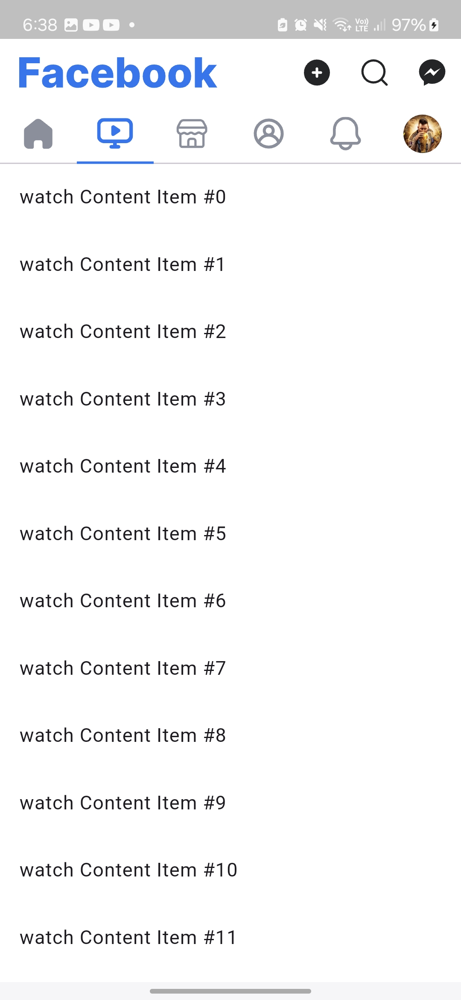
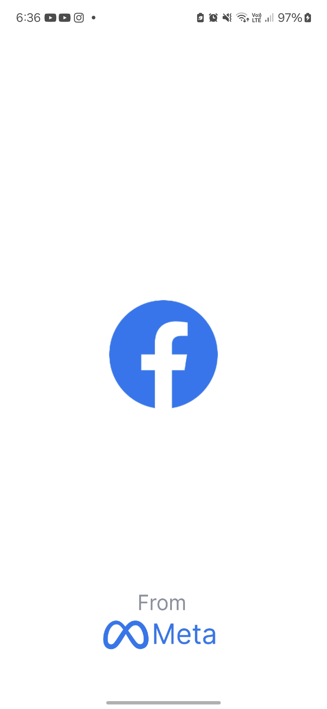

# 📘 facebook_clone

very similar Facebook login and home ui by flutter, using the most powerful sliver widgets.

## 📸 Screenshots

    
    
    

***

    
    
    

***
#### add shadow to the Text Form Field (just a UI update)

    
    

